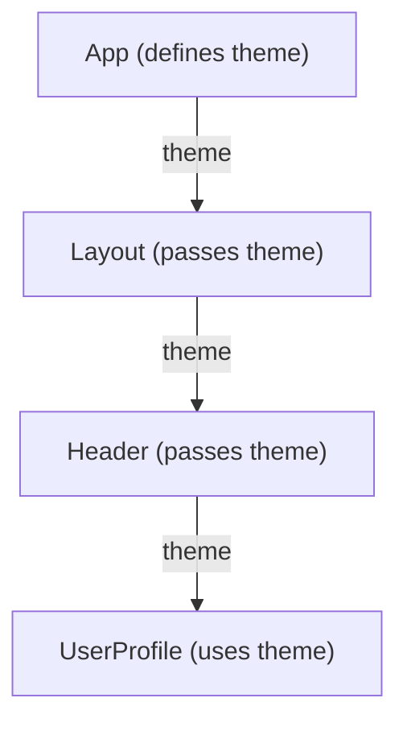

# Understanding and Solving Props Drilling in React

## What is Props Drilling?

Props drilling is a term used in React for the process of passing props from a parent component down through various levels of nested child components, even if some of those intermediate components don't directly use the props themselves. They merely act as conduits to forward the props to a deeper-level component that does need them.

**Common Drawbacks:**
- **Reduced Reusability:** Intermediate components become coupled to props they don't use, making them harder to reuse elsewhere.
- **Maintenance Challenges:** Refactoring or changing prop names/structures can require updates in many intermediate components.
- **Verbose Code:** Component signatures can become cluttered with props that are just being passed through.
- **Increased Error Proneness:** It's easier to miss passing a prop or misname it at some level in a deep component tree.

## Visualizing Props Drilling

Here's a simple diagram showing a `theme` prop being drilled down from `App` to `UserProfile`:



In this scenario, `Layout` and `Header` might not need the `theme` prop for their own rendering or logic, but they are forced to accept and pass it down.

## Example: Props Drilling in Action (Without Context)

Let's consider passing a `theme` prop to a deeply nested `UserProfile` component.

```tsx
// App.tsx
function App() {
  const theme = "dark"; // or "light"
  return <Layout theme={theme} />;
}

// Layout.tsx
// This component might have its own layout logic but doesn't use 'theme' directly.
function Layout({ theme }) {
  return (
    <div>
      {/* Other layout elements */}
      <Header theme={theme} />
    </div>
  );
}

// Header.tsx
// This component might display a title or nav links but doesn't use 'theme' directly.
function Header({ theme }) {
  return (
    <header>
      {/* Header content */}
      <UserProfile theme={theme} />
    </header>
  );
}

// UserProfile.tsx
// This component finally uses the theme to style itself.
function UserProfile({ theme }) {
  const style = {
    padding: '10px',
    margin: '10px 0',
    backgroundColor: theme === 'dark' ? '#333' : '#eee',
    color: theme === 'dark' ? '#fff' : '#333',
    border: '1px solid #ccc'
  };
  return <div style={style}>Current Theme: {theme}</div>;
}

export default App;
```
In this example, `Layout` and `Header` are "drilling" the `theme` prop.

## Solution: Using React Context API

React Context provides a way to pass data through the component tree without having to pass props down manually at every level. It's designed to share data that can be considered "global" for a tree of React components, such as the current authenticated user, theme, or preferred language.

**How it helps avoid props drilling:**
1.  **Create Context:** You create a Context object.
2.  **Provide Context:** A Provider component higher up in the tree makes the data available.
3.  **Consume Context:** Any component (no matter how deeply nested) that needs the data can consume it directly using the `useContext` hook or a Consumer component.

## Example: Solving Props Drilling with React Context

Let's refactor the previous example using Context.

```tsx
// contexts/ThemeContext.tsx
import React, { createContext, useContext } from 'react';

// 1. Create Context
const ThemeContext = createContext(null); // Default value can be null or a sensible default

// Custom hook for easy consumption
export function useTheme() {
  const context = useContext(ThemeContext);
  if (context === undefined) {
    throw new Error('useTheme must be used within a ThemeProvider');
  }
  return context;
}

// Provider component
export function ThemeProvider({ children, themeValue }) {
  // 2. Provide Context
  return (
    <ThemeContext.Provider value={themeValue}>
      {children}
    </ThemeContext.Provider>
  );
}

// App.tsx
import { ThemeProvider } from './contexts/ThemeContext';
// Assume LayoutWithContext, HeaderWithContext, UserProfileWithContext are defined below

function AppWithContext() {
  const appTheme = "dark"; // or "light"
  return (
    <ThemeProvider themeValue={appTheme}>
      <LayoutWithContext />
    </ThemeProvider>
  );
}

// LayoutWithContext.tsx
// No longer needs to know about 'theme' prop
function LayoutWithContext() {
  return (
    <div>
      {/* Other layout elements */}
      <HeaderWithContext />
    </div>
  );
}

// HeaderWithContext.tsx
// No longer needs to know about 'theme' prop
function HeaderWithContext() {
  return (
    <header>
      {/* Header content */}
      <UserProfileWithContext />
    </header>
  );
}

// UserProfileWithContext.tsx
import { useTheme } from './contexts/ThemeContext'; // Assuming ThemeContext.tsx is in a 'contexts' folder

function UserProfileWithContext() {
  // 3. Consume Context
  const theme = useTheme(); 
  
  const style = {
    padding: '10px',
    margin: '10px 0',
    backgroundColor: theme === 'dark' ? '#333' : '#eee',
    color: theme === 'dark' ? '#fff' : '#333',
    border: '1px solid #ccc'
  };
  return <div style={style}>Current Theme (from Context): {theme}</div>;
}

export default AppWithContext;
```
With Context, `LayoutWithContext` and `HeaderWithContext` are cleaner and don't need to be aware of the `theme` prop. `UserProfileWithContext` gets the `theme` directly.

## When to Use Context
- For data that many components at different nesting levels need (e.g., UI theme, user authentication, language).
- To avoid props drilling for genuinely global state.
- Be mindful of performance: when context value changes, all components consuming that context will re-render. For high-frequency updates or very complex state, other solutions (like Zustand, Redux, or component composition) might be more appropriate.

---
## Presentation Status: Draft 